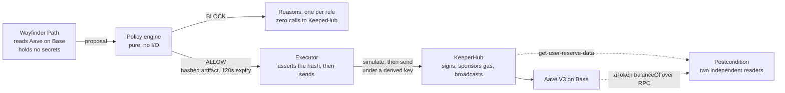
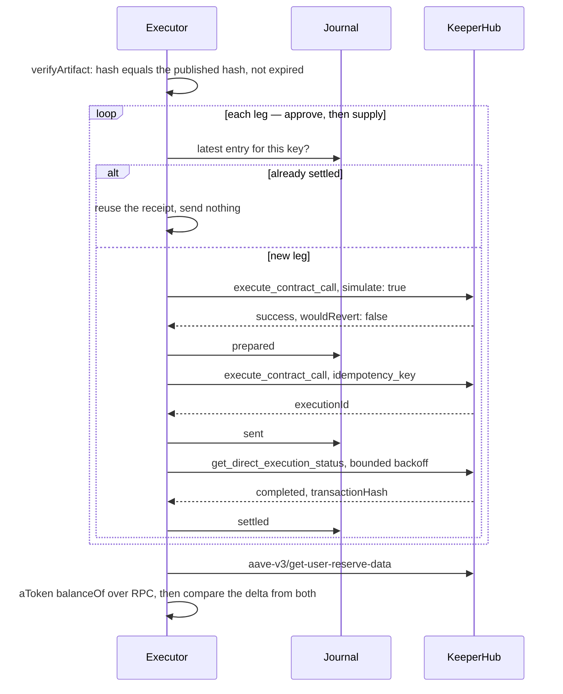
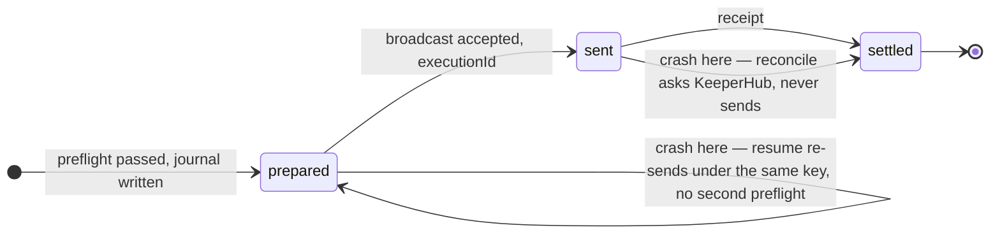

<p align="center">
  
</p>

<p align="center">
  <b>A policy gate between an agent that plans and the infrastructure that executes.</b><br>
  A Wayfinder Path proposes a DeFi action. MIRSAD binds it to one exact, hashed, expiring artifact.<br>
  <a href="https://keeperhub.com">KeeperHub</a> executes that artifact and nothing else.
</p>

<p align="center">
  <a href="https://github.com/farouk-allani/mirsad/actions/workflows/v2.yml"></a>
  <a href="https://basescan.org/tx/0x5a1eb2d97d576a6c4b65674a0c94d0af01a17ca9abd00ac1449a4cbc0fcb0345"></a>
  <a href="https://keeperhub.com"></a>
  <a href="https://github.com/KeeperHub/keeperhub/pull/2475"></a>
  
</p>

<p align="center">
  <a href="https://youtu.be/PycnVV03wWM">Three-minute demo</a> ·
  <a href="https://basescan.org/tx/0x5a1eb2d97d576a6c4b65674a0c94d0af01a17ca9abd00ac1449a4cbc0fcb0345">Mainnet transaction</a> ·
  <a href="https://github.com/KeeperHub/keeperhub/pull/2475">Upstream PR</a> ·
  108 tests
</p>

---

KeeperHub's pitch for the agent economy is that an agent composes a workflow, *you review it*, you dry-run it, and then that exact workflow executes — nothing is inferred at execution time. MIRSAD is what *"you review it"* becomes when the reviewer is a policy signed once in advance rather than a person reading calldata at two in the morning. The human signs a small, readable policy. Not a blank cheque to an agent.

> `مِرْصاد` — the watchpost; the place from which one lies in wait.

**Contents** — [The claim, demonstrated](#the-claim-demonstrated) · [Executed through KeeperHub](#executed-through-keeperhub) · [How it works](#how-it-works) · [When it is not the happy path](#when-it-is-not-the-happy-path) · [What this does not protect](#what-this-does-not-protect) · [Run it](#run-it) · [KeeperHub surfaces used](#keeperhub-surfaces-used) · [Things we found on the way](#things-we-found-on-the-way) · [Prior work](#prior-work)

---

## The claim, demonstrated

The planner is a real [Wayfinder Path](v2/integrations/wayfinder/paths/mirsad-guarded-aave/) reading the live Aave V3 market on Base through Wayfinder's official adapter. Same Path, same run, four proposals:

```
$ pnpm mirsad check --amount 1
  ALLOW   artifact 0xa662600979eff84d7ce388188750b55f93d393b1ac369f6f93332aadd899b041
          approve(pool, 1000000)
          supply(USDC, 1000000, 0x1f53…33f4, 0)
          expires 2026-09-09T21:59:08Z

$ pnpm mirsad check --amount 1 --beneficiary 0xdEAD…bEEF
  BLOCK   beneficiary   position would accrue to 0xdead…beef; policy names 0x1f53…33f4
          quiet: true   (zero calls to KeeperHub)

$ pnpm mirsad check --amount 1000
  BLOCK   amount        1000000000 exceeds the cap of 5000000 base units

$ pnpm mirsad check --symbol EURC
  BLOCK   allowlist     no policy entry permits aave-v3/supply … with token 0x60a3…db42
```

One hex digit changed in the beneficiary. The planner's rationale — 3.79% supply APY, $20M liquidity, market active — was identical in all four. None of it reached KeeperHub in the three that were blocked, because nothing reaches KeeperHub before the policy has seen it.

---

## Executed through KeeperHub

### Base mainnet, 14 September 2026

Wayfinder read the live market (3.631% supply APY, 23.4M USDC liquidity), proposed 1 USDC, MIRSAD allowed it, KeeperHub executed exactly the artifact.

| Leg | Transaction | Gas | Paid by |
|---|---|---|---|
| `approve(pool, 1000000)` | [`0xce7e567c…`](https://basescan.org/tx/0xce7e567c04c1634b2a047074436e9fac4829394acf7c80f8f75bec5a6739d6d9) | 117,316 | KeeperHub relayer `0x12fda741…` |
| `supply(USDC, 1000000, actor, 0)` | [`0x5a1eb2d9…`](https://basescan.org/tx/0x5a1eb2d97d576a6c4b65674a0c94d0af01a17ca9abd00ac1449a4cbc0fcb0345) | 235,114 | KeeperHub relayer `0x12fda741…` |

```
intentHash    0xb83384bcb84c3a4b3609dee35f768d3e806d1da7dfbd4327898cb1cca3a019a0
artifactHash  0x78522351d4493123c7b1a25163e643cc12ae6780601a7d8f731ba400e1d9d298
postcondition OK   aUSDC 0 -> 999,999   keeperhub and rpc agree
wallet ETH    0 before, 0 after
```

### Base Sepolia, where it was proven first

The same code, the same wallet, free test USDC — where the pipeline and the crash tests ran before a cent of real money was touched. All gas-sponsored, all through `execute_contract_call` with a preflight and an idempotency key. The wallet's ETH balance was 0 before and 0 after every one of them.

| Run | approve | supply | Postcondition |
|---|---|---|---|
| Wallet funds itself from Aave's faucet through the same execution path | [`0xb8089c4b…`](https://sepolia.basescan.org/tx/0xb8089c4b26993b741b2699dacd7c2d796499476cd8111c684a2063c3436537ee) | | 0 → 10 USDC |
| First full pipeline run | [`0xeff83b9a…`](https://sepolia.basescan.org/tx/0xeff83b9a113cfcc308b29e4375f199258e4f76f149c4f0f848e45ca61e3e3aca) | [`0x671aa688…`](https://sepolia.basescan.org/tx/0x671aa688d6a6190834646984e59e45851dbbc2423ded423cfaf1a9a696cdc58d) | 0 → 999,999 aUSDC |
| Second run, on top of an existing position | [`0x0045f3dc…`](https://sepolia.basescan.org/tx/0x0045f3dc9121e76f27a64f4e7cf6182c2149ab3fe71fddde2060e5e391f21c7c) | [`0x97ff6844…`](https://sepolia.basescan.org/tx/0x97ff68447413e966a36fc1367cb735f0d7f25aa5847571236b669ac199291962) | 999,999 → 1,999,998; both sources agree |
| **Killed after `prepared`, before any send; resumed** | [`0x9178de03…`](https://sepolia.basescan.org/tx/0x9178de03a6b653e1d40fcf3acdac267d1928f742ff049c1385d1b491500550e8) | [`0xbb060101…`](https://sepolia.basescan.org/tx/0xbb060101addb3295073daa737c954878227a798930f7652f380004890fc88736) | same key on resume, no second preflight |
| **Killed after the approve was broadcast, before its receipt; reconciled; resumed** | [`0x9f4b27df…`](https://sepolia.basescan.org/tx/0x9f4b27dfab28cca5769372d2eca071d99042bcb9f021e2852ac78f5ea1ce057e) | [`0x4627dfa1…`](https://sepolia.basescan.org/tx/0x4627dfa12cc972ba6d9201d8ffbfad1665729a550e0d4a2ca409b229267353fe) | approve reused from the journal; exactly one on chain |

The first runs found three bugs, which is what first runs are for. The report crashed on printing a `bigint` — after the sends, so the journal was the only record of what happened, and it was complete. Aave's scaled-balance arithmetic rounds a 1 USDC supply down to 999,999 on the way back; the postcondition had said "may never fall short" and would have failed a correct execution. And the idempotency key was derived from the artifact, which carries `issuedAt`, so a crash-and-re-decide would have double-sent — found by the first crash test. All three are fixed, tested, and described below.

The faucet mint is a meta-transaction: the relayer `0xdcf4bac4…` paid, the forwarder `0x5af5194b…` (the same forwarder as on Ethereum Sepolia) delivered. Preflight estimated 88,834 gas; the forwarder path used 149,811. Do not budget gas for a sponsored write off the simulation.

Every transaction this repository has ever executed through KeeperHub — including the four onchain vetoes from [v1](docs/LEGACY.md) — is listed with its explorer link. There are no screenshots.

---

## How it works



### Three documents, one of them trusted

**`ExecutionIntent`** is what the planner proposes. Chain, protocol, action, target contract, token, amount in base units, beneficiary, and the block it observed. It is untrusted. Every field may be wrong, stale or hostile, and the schema is strict: an unrecognised field is a parse failure, and a parse failure is a BLOCK.

**`Policy`** is what the operator agreed to, once, in advance. An exact list of permitted `(protocol, action, target, token)` tuples, an amount cap, the one address a position may accrue to, and how stale an observation may be. It is the only trusted input. It is hashed, and the hash travels with every decision.

**`ApprovalArtifact`** is what an ALLOW is worth: the exact calls, with their arguments, hashed, with a two-minute expiry. Not a permission — a transaction, described precisely enough to be rebuilt byte for byte.

### What the executor does with an artifact



### Two properties carry the design

**The thing simulated is the thing sent.** The executor rebuilds its KeeperHub request from the artifact and refuses before building anything if the artifact does not hash to the value the decision published. [Three tests](v2/packages/keeperhub/src/execute.test.ts) edit a settled artifact in transit — beneficiary, approval amount, chain — and assert zero calls to KeeperHub.

**The idempotency key is a pure function of the proposal and the policy.** `mirsad:<hash(intentHash, policyHash)>:<leg>`. The same proposal under the same policy gets the same key on any machine, after any crash, without consulting stored state; a different proposal gets a different key, because the intent hash covers every argument that reaches the chain. Not the artifact hash — an artifact carries `issuedAt`, and a process that crashed and decided the same proposal again would mint a new one. KeeperHub's own guidance is to keep the key and rebuild the body when an outcome is unknown, since rotating it escapes the in-flight guard and can broadcast twice. Deriving the key from the inputs that determine the body makes that the only reachable behaviour.

### Smaller decisions that follow

- MIRSAD **derives** the ERC-20 approval, it does not accept one. An unlimited allowance is not something a planner can ask for; only a large *amount* could reach one, and the cap catches that.
- ABIs are pinned in the executor, not carried in the artifact. An ABI supplied by a planner is a planner deciding what a function means.
- A permitted action with no call builder is refused. Widening the allowlist cannot widen what executes.
- Amounts never travel as JavaScript numbers. `0.1` and `0.10` are one value and two byte strings, and KeeperHub's idempotency documentation names that exact drift as a cause of a 409 against a key already bound to the earlier body.
- The planner runs in an environment that is built, not inherited. Wayfinder's local runner hands Path code `os.environ.copy()`; a community-authored Path must not be able to read an organization key, and [a test](v2/packages/agent/src/plan.test.ts) plants one and asserts it does not arrive.

---

## When it is not the happy path

The executor's outcomes separate *did not execute* from *do not know*. Collapsing the second into the first is how a retry becomes a second transaction.

| Outcome | Meaning | Correct next action |
|---|---|---|
| `executed` | Every leg settled with a receipt, and the position read back as expected | None |
| `artifact-invalid` | Hash mismatch, expired, or a function with no pinned ABI | Re-evaluate; nothing was sent |
| `simulation-reverted` | KeeperHub's preflight says it reverts | Nothing was sent |
| `unavailable` | 429 or 5xx *before* the send; `Retry-After` is surfaced | Retry later, same request |
| `request-drift` | The rebuilt body no longer matches the one bound to the key | Stop. Do not rotate the key |
| `rejected` | Definite refusal after a clean preflight, or settled as failed | A person decides |
| `unconfirmed` | 5xx or dropped socket *on* the send; status never settled | Same key; `reconcile` |

### The journal, and what a crash leaves behind

A journal is written as `prepared` before any send, so a process killed between persisting and broadcasting leaves proof that a broadcast may have happened.



`pnpm mirsad reconcile` asks KeeperHub about anything unfinished and never sends; re-running `execute` with the same proposal resumes under the same key and skips legs that already settled. Both crash edges in the diagram were exercised on chain — the two killed runs in the Sepolia table.

Crashes are injected, not hoped for: `MIRSAD_FAULT=after-prepared` or `after-sent` exits the process at that point. Nothing in production sets it.

### Postcondition

Success additionally requires the position to have moved. The aToken balance is read before and after from two sources that share no code path — Aave's reserve data through KeeperHub, and `balanceOf` on the aToken over plain RPC. A settled receipt with an unmoved position is `executed` with `postcondition.ok: false`, and a disagreement between the two readings is resolved against us. Two units of shortfall are tolerated, because Aave's scaled-balance arithmetic rounds down; two thousand are not.

Forty-three tests cover this section: revert, 503, 429 with `Retry-After`, 409 conflict, dropped socket, never-settles, settled-failed, a crash between prepare and send, an already-settled leg, a rebuilt request that no longer matches the key's bound body, and the same proposal decided again after a crash landing on the same key.

---

## What this does not protect

- **The policy itself.** If the operator signs a policy naming the attacker as beneficiary, MIRSAD will faithfully enforce it. The policy file is the thing to guard.
- **Anything outside the Path.** Wayfinder has local signing and broadcast utilities. MIRSAD gates *this* Path's execution; it is not framework-wide enforcement, and the README does not claim otherwise.
- **State between check and send.** KeeperHub's preflight is a point-in-time `eth_call`. The two-minute artifact expiry and the postcondition bound the damage; they do not eliminate it.
- **The operator's KeeperHub account.** Whoever holds the `kh_` key can execute anything. MIRSAD assumes that key is held by the operator's trusted process and never by the planner.
- **Protocols it has not been taught.** One protocol pack exists: Aave V3 supply of USDC on Base. Everything else is `unsupported-action`.

---

## Run it

```bash
pnpm install
pnpm v2:build
python3.12 -m venv v2/integrations/wayfinder/.venv   # py -3.12 on Windows
v2/integrations/wayfinder/.venv/Scripts/pip install wayfinder-paths==0.11.0   # bin/pip elsewhere

export KEEPERHUB_API_KEY=kh_...          # organization key; a wfb_ key is a different system
export MIRSAD_ACTOR=0x...                # the KeeperHub organization wallet

pnpm mirsad plan                          # what Wayfinder proposes, and why
pnpm mirsad check                         # decide; never broadcasts
pnpm mirsad check --beneficiary 0xdead…   # a compromised planner
pnpm mirsad execute --amount 1            # decide, simulate, send, prove
pnpm mirsad execute --proposal saved.json # the same, from a saved proposal
pnpm mirsad journal                       # what previous runs left behind
pnpm mirsad reconcile                     # ask KeeperHub about anything unfinished
```

`check` and `execute` run identical code up to the point of sending. The thing you inspected is the thing that executes.

Tests: `pnpm v2:test` — 108 across the policy engine, the executor and the planner boundary, none of which touch the network.

| Package | Holds |
|---|---|
| [`v2/packages/policy`](v2/packages/policy) | canonical encoding, the three schemas, the five rules, the Aave pack |
| [`v2/packages/keeperhub`](v2/packages/keeperhub) | MCP transport, artifact-bound executor, journal, reconcile, postcondition readers |
| [`v2/packages/agent`](v2/packages/agent) | planner boundary with the scrubbed environment, the pipeline, the CLI |
| [`v2/integrations/wayfinder`](v2/integrations/wayfinder) | the Wayfinder Path |

---

## KeeperHub surfaces used

| Surface | Where |
|---|---|
| MCP server, JSON-RPC over Streamable HTTP | [`transport.ts`](v2/packages/keeperhub/src/transport.ts) — pins `KeeperHub-Version: 1`, honours `Retry-After`, warns on `Sunset` |
| `execute_contract_call` with `simulate: true`, then `idempotency_key` | [`execute.ts`](v2/packages/keeperhub/src/execute.ts) — the documented safe-write sequence, with the hash check in front of it |
| `get_direct_execution_status` | polling with bounded backoff; `reconcile` |
| `execute_protocol_action` → `aave-v3/get-user-reserve-data` | one of the two independent postcondition readers |
| Gas sponsorship | every transaction above, on three chains |
| Marketplace, x402 | `mirsad-safe-guard`, listed at $0.05/call in v1; still answers a `402` with a Base USDC challenge |

Why `execute_contract_call` and not the `aave-v3/supply` protocol action: the protocol action has no dry-run — its own description says *"writes sign and broadcast"* — so nothing routed through it can be preflighted, and MIRSAD's entire claim is that the preflighted bytes are the sent bytes. The raw ABI route is the one that can make that promise.

---

## Things we found on the way

Logged as they happened, in the style of [v1's teardown](docs/FRICTION.md).

- **`aave-v3/supply` takes base units; `web3/approve-token` takes human units.** Two adjacent actions in the same flow, opposite conventions, and the MCP schema says `string` for both. The unit is stated in the field label — `Amount (wei)` — and the schema builder drops the label; 102 protocol inputs across 14 protocol files lose their unit the same way. Filed as [KeeperHub/keeperhub#2466](https://github.com/KeeperHub/keeperhub/issues/2466), accepted by a maintainer the same night, fixed in [PR #2475](https://github.com/KeeperHub/keeperhub/pull/2475): one expression in the shared builder plus a sweep test that fails below fifty matches. Our own Phase 0 notes guessed the other way and would have supplied 0.000001 USDC.
- **Base Sepolia's Aave "USDC" is not Circle's USDC.** The market uses Aave's test token `0xba50Cd2A…`, not the `0x036CbD53…` bridged one. Substituting the familiar address reverts in a way that reads as a permissions problem.
- **Wayfinder's Aave adapter is mainnet-only.** Chain 84532 is rejected as unsupported, so planning happens on Base.
- **Simulation gas is not sponsored gas.** 88,834 estimated, 149,811 used, on two chains now.
- **The CLI's billing parser rejects the live response.** `overageCharges` is an array; the CLI expects a number.

---

## Prior work

MIRSAD v1 (August 2026) was a Safe multisig watchtower that wrote binding onchain vetoes through KeeperHub: two contracts on Sepolia, four autonomous vetoes, a 2-of-3 Safe where three signatures were not enough to move the treasury. The contracts are still deployed and verified, and the transactions still check out. It is documented in full in [docs/LEGACY.md](docs/LEGACY.md), and its code is under [`packages/`](packages/) and [`apps/`](apps/).

v2 reuses its principles — rules gate, hash-linked audit, honest limits — and none of its code. The problem moved from "should the Safe execute what its owners signed" to "should KeeperHub execute what the agent planned", and that is a different shape.

---

MIT.
